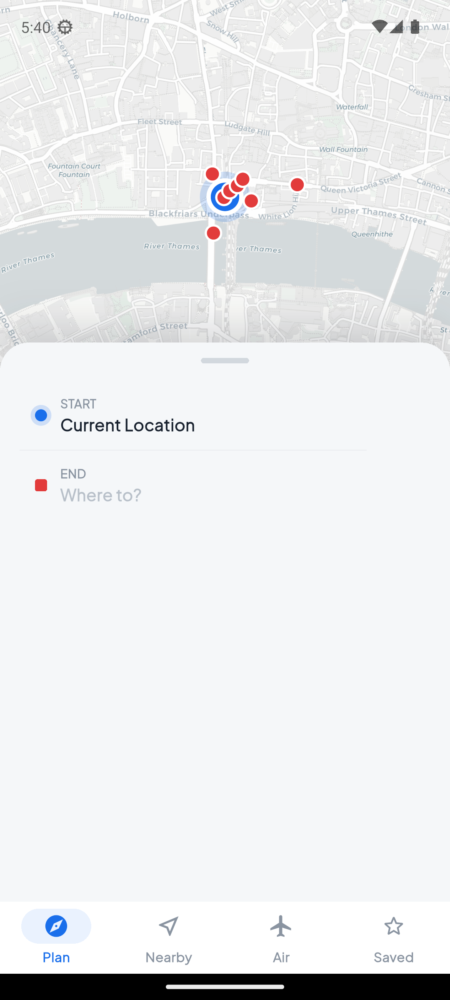
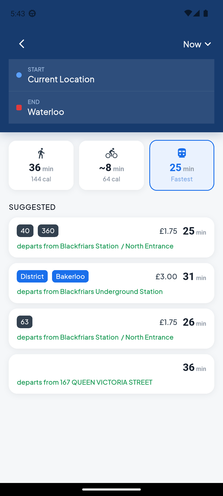
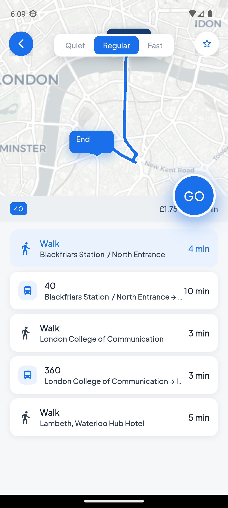
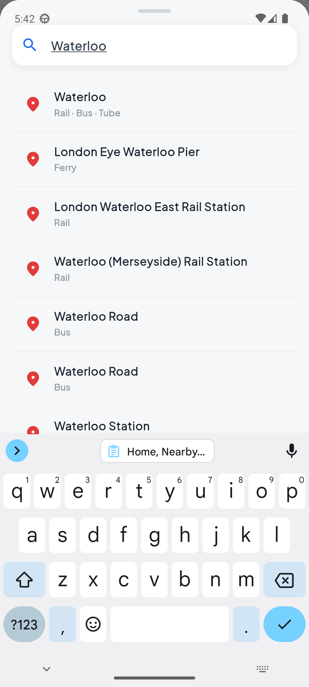
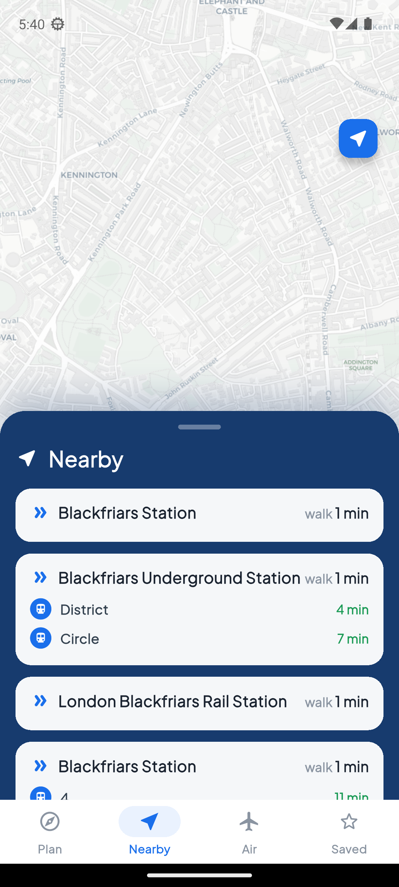
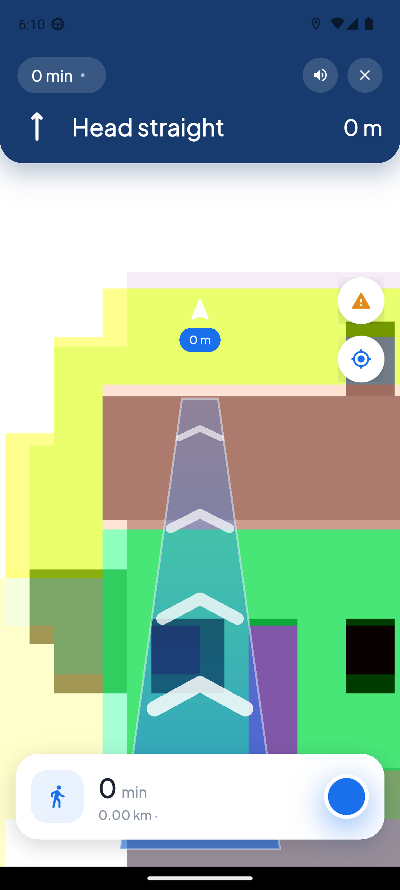
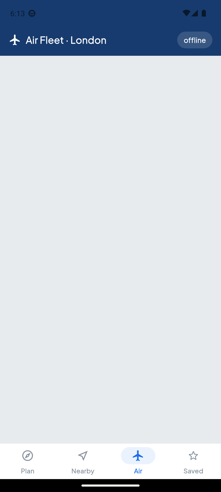
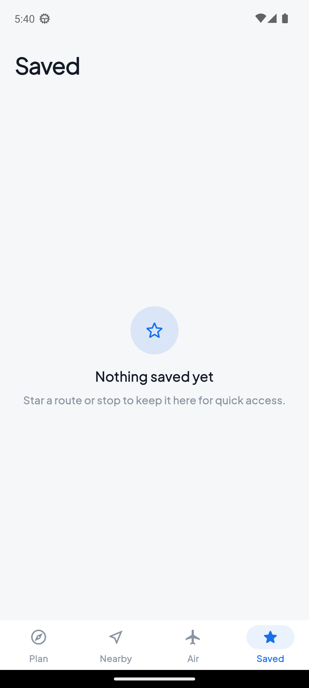

# Tube — London Transit

A production-quality, cross-platform **Flutter** app for planning and navigating
London transit routes, with **AR-only turn-by-turn navigation** and a **live air-fleet**
map. Built to match the *Tube · London Transit* design system — blue-forward identity
(primary `#1A6FEB`), clean high-contrast cards, Material 3.

<p align="center"><b>Blue identity · TfL live data · AR navigation · Live air fleet</b></p>

---

## Screenshots

Captured live on an Android device — real Transport for London data.

| Home (search) | Route results | Route detail |
|:---:|:---:|:---:|
|  |  |  |
| **Live search** | **Nearby stops & lines** | **AR navigation** |
|  |  |  |
| **Air fleet** | **Saved** | |
|  |  | |

> Results, Nearby, Search and Route detail show **live TfL Journey Planner / StopPoint / arrivals** data.
> The AR image is a render of the overlay itself — a **ground-anchored perspective route ribbon** with a
> soft glow, bright edges and forward-flowing chevrons that bend toward the next turn — drawn over the live
> camera on a real device (the emulator has no real camera). The Air Fleet feed uses OpenSky, whose anonymous
> tier is rate-limited (hence the "offline" state here — add credentials for live aircraft).

---

## Features

| # | Screen | What it does |
|---|--------|--------------|
| S1 | **Home / Search** | Start + end fields with swap, mode filter chips (Bus, Tube, Rail, Tram, Ferry, Cycle, Air, All), nearby stops with live next-departure times |
| S2 | **Route Results** | TfL Journey Planner results ranked, with walking/cycling comparison (time + calories) and a depart-now / depart-at picker |
| S3 | **Route Detail** | 2D map with the blue route polyline, start/end pins, step-by-step legs, Quiet/Regular/Fast tabs, and the blue **GO** button |
| S4/S7 | **AR Navigation** | **AR-only.** Camera feed + sensor-fused path chevrons, turn cards, destination bearing, remaining-time pill, audio toggle, report, exit. No 2D fallback |
| S5 | **Nearby** | Radius map + navy sheet of nearby stops and live lines |
| S6 | **Air Fleet** | Live aircraft over London, tap for altitude / speed / callsign / heading, auto-refreshing |
| — | **Saved** | Saved routes + stops, persisted locally (Hive) |

---

## Tech stack

- **Flutter + Dart** (null-safe, Material 3)
- **State:** Riverpod (`journeyProvider`, `nearbyStopsProvider`, `arrivalsProvider`, `airFleetProvider`, `savedProvider`)
- **Navigation:** go_router (bottom-nav shell + pushed detail/AR routes)
- **Networking:** dio, typed models with hand-written `fromJson`
- **Maps:** flutter_map + CartoDB tiles (no key) with blue polyline rendering
- **AR:** `camera` live feed + `flutter_compass` + `sensors_plus` + `geolocator` sensor fusion, driving `CustomPainter` chevrons anchored to real-world bearing
- **Storage:** Hive
- **Motion/UI:** flutter_animate, google_fonts (Plus Jakarta Sans)

### Project structure
```
lib/
  main.dart              app bootstrap + ProviderScope
  router.dart            go_router config
  theme/                 app_colors, app_spacing, app_theme (M3 seeded from #1A6FEB)
  models/                transport_mode, stop_point, arrival, journey, aircraft, saved_item
  services/              tfl_service, air_fleet_service, location_service, storage_service, api_config
  providers/             providers.dart (all Riverpod providers + search state)
  widgets/               buttons, chips, common, rows, route_card, map_view, state_views
  screens/               home, results, route_detail, nearby, airports, saved, shell + sheets
  ar/                    nav_controller, geo_math, ar_overlay_painter, ar_navigation_screen
```

---

## Setup

### 1. Prerequisites
- Flutter (latest stable, Dart ≥ 3.12) — `flutter doctor`
- Android Studio / Xcode for device builds

### 2. Install
```bash
flutter pub get
```

### 3. API keys (via `--dart-define`)
All secrets are injected at build time — nothing is hard-coded.

| Key | Purpose | Required? |
|-----|---------|-----------|
| `TFL_APP_KEY` | TfL Unified API key | Optional — the app runs key-less at a low rate limit |
| `TFL_APP_ID` | TfL app id | Optional |
| `OPENSKY_USER` / `OPENSKY_PASS` | OpenSky Network credentials (higher air-fleet quota) | Optional — anonymous access works |
| `AIR_FLEET_URL` / `AIR_FLEET_KEY` | Point the air-fleet layer at a bespoke provider instead of OpenSky | Optional |

- **TfL key:** register at <https://api-portal.tfl.gov.uk> → *Products* → get an app key.
- **OpenSky:** register at <https://opensky-network.org>.

### 4. Run
```bash
flutter run \
  --dart-define=TFL_APP_KEY=YOUR_TFL_KEY \
  --dart-define=OPENSKY_USER=YOUR_USER \
  --dart-define=OPENSKY_PASS=YOUR_PASS
```
No keys? `flutter run` alone still works (TfL key-less + OpenSky anonymous).

For a saner secrets workflow, put the defines in a `dart_defines.json` and run
`flutter run --dart-define-from-file=dart_defines.json`.

---

## AR device requirements

AR navigation is **camera + sensor-fusion based** and needs:

- **Android:** an **ARCore-class** device — a rear camera + magnetometer/compass.
  Permissions: `CAMERA`, `ACCESS_FINE_LOCATION` (declared in `AndroidManifest.xml`).
- **iOS:** an **ARKit-class** device (iPhone 6s or newer). Usage strings for camera,
  location and motion are declared in `Info.plist`.

If the camera permission is denied or no compatible camera exists, the AR screen shows
a clear prompt to enable it — **there is deliberately no 2D map fallback in navigation
mode**, per the product spec.

> **Implementation note.** AR is built on the `camera` feed + compass/GPS/IMU fusion
> (rather than `ar_flutter_plugin`, which frequently breaks cross-platform builds). This
> renders the exact S7 experience — camera feed with floating chevrons, turn cards and a
> bearing-anchored destination marker — while compiling reliably on both platforms.

---

## Data sources

- **TfL Unified API** (`https://api.tfl.gov.uk`): Journey Planner (`/Journey/JourneyResults`),
  StopPoint search + nearby (`/StopPoint`), live arrivals (`/StopPoint/{id}/Arrivals`).
- **Air fleet:** OpenSky Network `states/all` by bounding box, abstracted behind
  `AirFleetService` so the source can be swapped (`GenericAirFleetService` adapter included).
- **Device geolocation** via geolocator for live position & AR tracking.

---

## Notes
- Map tiles use CartoDB Positron/Dark (light & dark aware) — no key needed. Swap the
  `urlTemplate` in `lib/widgets/map_view.dart` for MapTiler/Mapbox if you prefer.
- Live data (arrivals every 30s, air fleet every 15s) auto-refreshes via Riverpod.
- Theme everything from `lib/theme/` — the whole app is seeded from `#1A6FEB`.
